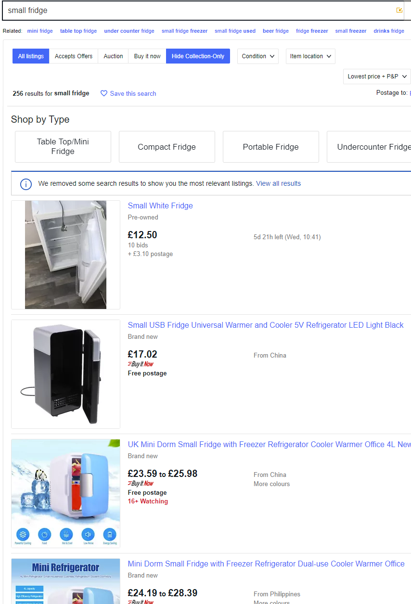
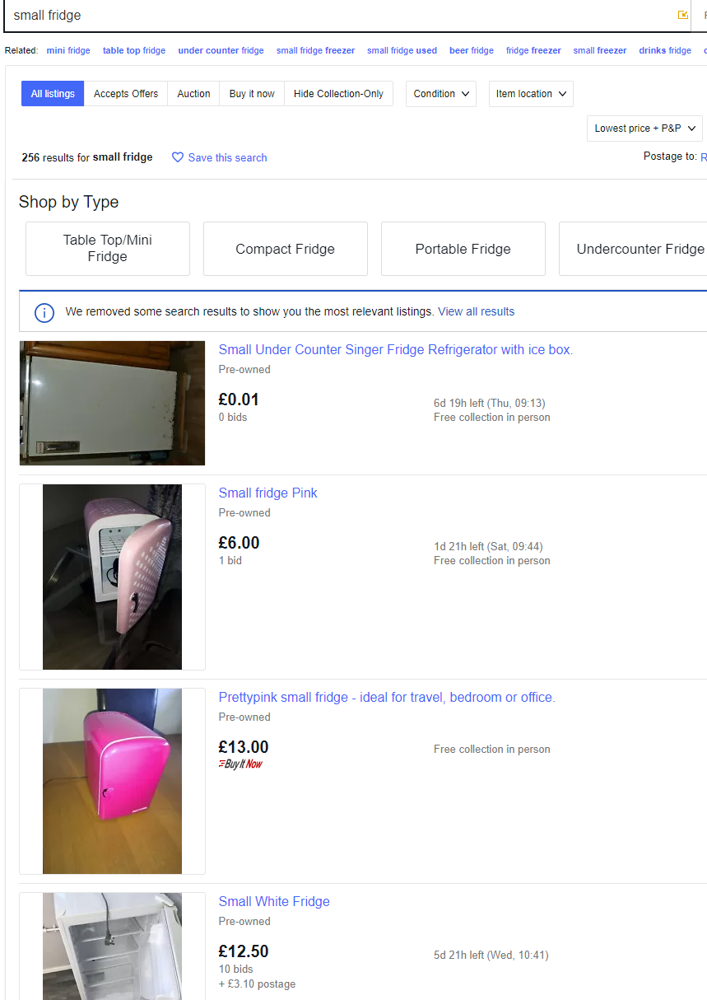

# Hide Collection Only eBay Extension

This is a simple extension that adds a 'Hide Collection-Only' button to eBay search results.

This toggle persists through page loads and can be dynamically turned on and off.

## Installation

[Chrome Web Store](https://chrome.google.com/webstore/detail/hide-collection-only-butt/dcbnhdjfmnfkblehlkpgeabnhmhnamdl)

[Firefox Addon Store](https://addons.mozilla.org/en-GB/firefox/addon/hide-collection-only-on-ebay/)

## Issues?

- If you encounter any issues, please [open an issue](https://github.com/Makeshift/Hide-Collection-Only-eBay/issues/new) with a link to the page it doesn't work on.
- If it doesn't work on your regional eBay, it may be due to a translation error. If the extension works when you're on a search page (where the URL begins with `ebay.<ext>/sch/`) but not on a browse page (where the URL begins with `ebay.<ext>/b/`), it will be because I translated the text `Collection in person` to your language incorrectly. Please [open an issue](https://github.com/Makeshift/Hide-Collection-Only-eBay/issues/new) with the corrected translation if possible.

For those wondering, while the `/sch/` page uses a unique CSS class to mark an item as collection-only, unfortunately the `/b/` pages do not, so we have to look for the text specifically.

### Permissions

This extension uses the `storage` permission to store the state of the toggle. This permission is required, as [content scripts cannot access most `chrome` API's](https://stackoverflow.com/a/18195744)(to check if the permission was given) and I didn't want to overcomplicate this very simple extension.

Also, [DeclarativeAction](https://developer.chrome.com/extensions/declarativeAction) isn't available in content scripts either, so the best we can do is MutationObservers :(

### Images

#### Enabled

#### Disabled

